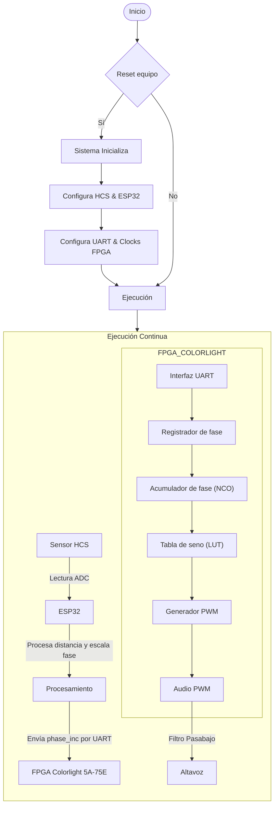

# THEREMIN (PROYECTO ELECTRÓNICA DIGITAL)
En el presente repositorio se expondrá en que conssitió el proyecto realizado en la aignatura de electrónica digital, mostrando el paso a paso realizado
- Dilan Mateo Torres Muñoz
- Arturo Moreno Covaría
- Nicolás Zarate Acosta
- 

Bienvenidos a nuestro repositorio del proyecto final de nuestra clase de electrónica digital de la Universidad Nacional de Colombia del semestre 2025-I, el cual consistía en el diseño y posterior implementación de  un theremin (instrumento musical), realizando una versión digital de este mismo mediante el uso de sensores ultrasónicos, FPGA y ESP32.

# Objetivos del proyecto
- Construir un diseño electrónico que detecte movimiento, en este caso que detecte el movimiento de la mano y la posición de ella mediante sensores ultrasónicos
- Diseñar un modelo que permita generar sonidos, con sus respectivas características (frecuencia y volumen) según la distancia detectada por el sensor.

# ¿Que es un theremin?

Un theremin es un instrumento musical electrónico inventado por Léon Theremin, que se caracteriza por ser tocado sin contacto físico directo. Se controla mediante el movimiento de las manos alrededor de dos antenas, una para el tono y otra para el volumen, alterando campos electromagnéticos.

# Planteamiento

## Requrimentos funcionales:
## Diagrama ASM/ Maquina de estados/ diagramas funcionales:
## Diagrama RTL del SoC y su mòdulo:
## Simulaciones:
## Video simulacion: 
## Logs de make log-prn, make log-syn
## ¿Còmo interactùa con entornos externos?
## Video del proyecto

