# THEREMIN (PROYECTO ELECTRÓNICA DIGITAL)
En el presente repositorio se expondrá en que conssitió el proyecto realizado en la aignatura de electrónica digital, mostrando el paso a paso realizado
- Dilan Mateo Torres Muñoz
- Arturo Moreno Covaría
- Nicolás Zarate Acosta
- 

Bienvenidos a nuestro repositorio del proyecto final de nuestra clase de electrónica digital de la Universidad Nacional de Colombia del semestre 2025-I, el cual consistía en el diseño y posterior implementación de  un theremin (instrumento musical), realizando una versión digital de este mismo mediante el uso de sensores ultrasónicos, FPGA y ESP32.

# Objetivos del proyecto
- Construir un diseño electrónico que detecte movimiento, en este caso que detecte el movimiento de la mano y la posición de ella mediante sensores ultrasónicos
- Diseñar un modelo que permita generar sonidos, con sus respectivas características (frecuencia y volumen) según la distancia detectada por el sensor.

# ¿Que es un theremin?

Un theremin es un instrumento musical electrónico inventado por Léon Theremin, que se caracteriza por ser tocado sin contacto físico directo. Se controla mediante el movimiento de las manos alrededor de dos antenas, una para el tono y otra para el volumen, alterando campos electromagnéticos.

# Planteamiento

```mermaid
flowchart TB
  %% Theremin Digital - Flujo General (de arriba hacia abajo)
  start([Inicio])
  start --> RESET{Reset equipo}
  RESET -- Sí --> INIT[Sistema Inicializa]
  INIT --> SENSOR_INIT[Configura HCS & ESP32]
  SENSOR_INIT --> FPGA_INIT[Configura UART & Clocks FPGA]
  FPGA_INIT --> RUN[Ejecución]
  RESET -- No --> RUN

  subgraph Loop[Ejecución Continua]
    direction TB
    HCS[Sensor HCS] -->|Lectura ADC| ESP32[ESP32]
    ESP32 -->|Procesa distancia y escala fase| ESP32_PROC[Procesamiento]
    ESP32_PROC -->|Envía phase_inc por UART| FPGA[FPGA Colorlight 5A-75E]
    subgraph FPGA_COLORLIGHT
      direction TB
      REG_IF["Interfaz UART"] --> PHASE_ACC["Registrador de fase"]
      PHASE_ACC --> NCO["Acumulador de fase (NCO)"]
      NCO --> WAVE_LUT["Tabla de seno (LUT)"]
      WAVE_LUT --> PWM_GEN["Generador PWM"]
      PWM_GEN --> AUDIO_OUT["Audio PWM"]
    end
    AUDIO_OUT -->|Filtro Pasabajo| SPEAKER[Altavoz]
  end

  RUN --> Loop
```

## Requrimentos del proyecto:

### ✅ Requerimientos Funcionales

- 🧭 **Medición de distancia**
  - Se utilizan sensores ultrasónicos (HC-SR04) para medir distancia en centímetros.
  - Se usan dos sensores: uno para la nota y otro para el volumen.

- 🎵 **Generación de nota MIDI**
  - Convierte la distancia medida en una nota MIDI válida (0–127).
  - Evita repetir la misma nota si no hay cambios.

- 🔊 **Generación de volumen MIDI**
  - Escala la segunda distancia a un valor de velocidad (volumen) MIDI (0–127).

- 🎼 **Codificación de mensajes MIDI**
  - Crea mensajes `Note On` y `Control Change` válidos según el estándar MIDI.

- 📤 **Transmisión UART**
  - Envía los datos MIDI usando UART a 31250 baudios, 8 bits, sin paridad, 1 bit de parada.

- 🧩 **Integración de módulos**
  - Un módulo principal (`top_module.v`) conecta todos los componentes del sistema.
  - El sistema opera sincronizado por una señal de reloj (`clk`).

---

### ⚙️ Requerimientos No Funcionales

- 📦 **Modularidad**
  - Cada funcionalidad está separada en módulos Verilog independientes.

- 🧪 **Simulación con testbenches**
  - Archivos de prueba (`midi_note_sender_tb.v`, `midi_volume_sender_tb.v`) simulan la entrada de distancias y verifican la salida MIDI.

- 📈 **Simulación funcional**
  - Compatible con simuladores como Icarus Verilog + GTKWave.

- 🛠️ **Escalabilidad**
  - El diseño permite la integración de más sensores o generación de otros mensajes MIDI.

- 📝 **Código documentado**
  - Cada módulo está comentado para facilitar su comprensión y mantenimiento.

---

### 🧠 Potencial de Expansión: SoC Real

Aunque actualmente es un SoC lógico simulado, este proyecto puede escalarse a un **SoC físico embebido** mediante:

- Integración en un FPGA o ASIC
- Incorporación de un microcontrolador embebido (RISC-V, ARM)
- Soporte para memoria interna (RAM/ROM)
- Interfaz con sintetizadores reales por MIDI DIN o USB-MIDI

---

### 📁 Módulos Verilog

| Archivo                  | Función |
|--------------------------|---------|
| `ultrasonic_sensor.v`    | Mide la distancia con sensores ultrasónicos |
| `midi_note_sender.v`     | Convierte distancia a nota MIDI |
| `midi_volume_sender.v`   | Convierte distancia a volumen MIDI |
| `uart_tx.v`              | Transmisor UART compatible MIDI |
| `top_module.v`           | Integra todos los módulos anteriores |
| `*_tb.v`                 | Testbenches para simular comportamiento |

---
## Diagrama ASM/ Maquina de estados/ diagramas funcionales:
## Diagrama RTL del SoC y su mòdulo:
## Simulaciones:
## Video simulacion: 
## Logs de make log-prn, make log-syn
## ¿Còmo interactùa con entornos externos?
## Video del proyecto

